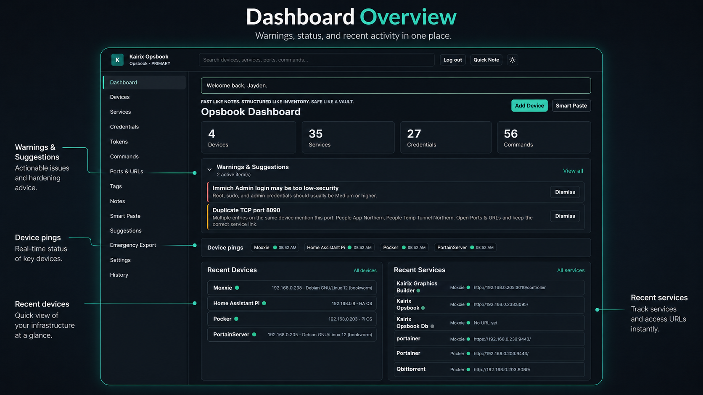
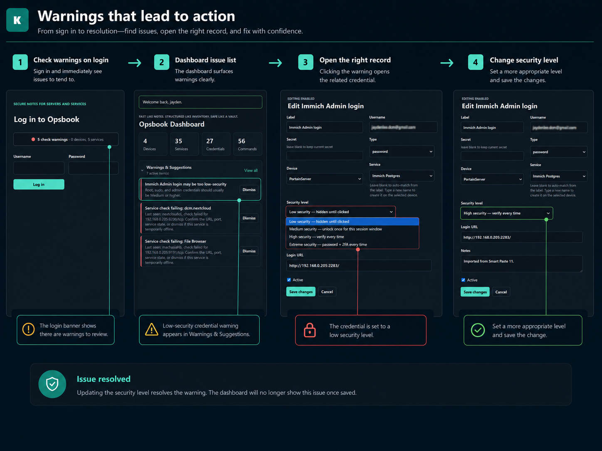
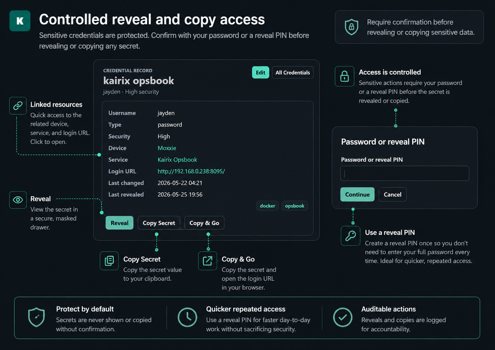

# Kairix Opsbook

Kairix Opsbook is a self-hosted operations notebook for servers, Docker stacks, credentials, commands, URLs, ports, backups, setup notes, and recovery notes.

It is designed to be fast like notes, structured like inventory, and safe like a vault. The app focuses on documenting what exists, where it runs, how to log in, what commands to copy, and how to recover it later.

## Screenshots

### Dashboard Overview

<p align="center">
  
</p>

The dashboard gives you a quick view of warnings, device status, recent devices, recent services, and recent activity in one place.

## Feature Walkthroughs

### Warnings That Lead To Action

<p align="center">
  
</p>

Opsbook can surface issues such as low-security credentials or failed service checks, then help you jump to the related record so you can review and fix the problem.

### Controlled Reveal And Copy Access

<p align="center">
  
</p>

Credential actions such as reveal, copy, and Copy & Go can require confirmation with your password or a reveal PIN. The reveal PIN is useful for quicker repeated access without entering the full password every time.

## Features

- FastAPI web app with a simple server-rendered UI.
- PostgreSQL via Docker Compose.
- Owner setup, login sessions, CSRF-protected forms, and session timeout.
- Devices, services, credentials, commands, ports, URLs, notes, tags, search, and history.
- Read-only-first device and service pages.
- Encrypted credential storage with Low, Medium, High, and Extreme security levels.
- Tokens & APIs section for GitHub PATs, Home Assistant/API tokens, and other temporary or service-linked access keys.
- Credential reveal audit log.
- Optional TOTP 2FA setup with a QR code for authenticator apps.
- Copy-friendly command library with starter Linux, Docker, Docker Compose, Git, networking, stability, and recovery commands.
- Smart Paste import with review-before-apply for notes, SSH output, Docker output, URLs, ports, paths, commands, service login blocks, and GitHub token pages.
- Service validation checks documented URLs and ports with a simple TCP connection and records the last result.
- Background device pings with browser-local time display, plus optional login-time device/service refresh checks.
- Optional ping webhooks for Home Assistant or other listeners. Webhooks can report devices, services, or both, and recovery/pass events are sent only when a previous failure comes back.
- Suggestions for missing backup notes, duplicate ports, low-security admin credentials, and missing purpose fields, with quick inline fixes for simple cleanup.
- Emergency encrypted backup export, human-readable runbook HTML export, and encrypted import.
- Mirror/read-only standby mode for backup servers.

## Quick Start

```bash
git clone https://github.com/Dubcodes/Kairix-Opsbook.git
cd Kairix-Opsbook
cp .env.example .env
nano .env
docker compose up -d --build
```

Open:

```text
http://SERVER-IP:8095
```

On first run, create the owner account. Change the database password and all secret keys in `.env` before storing real credentials.

## Configuration

Important `.env` values:

```text
OPSBOOK_IMAGE_TAG=0.1.21
APP_PORT=8095
INSTANCE_NAME=Opsbook
INSTANCE_MODE=primary
POSTGRES_PASSWORD=change-this-database-password
OPSBOOK_SECRET_KEY=change-this-secret-encryption-key
EXPORT_SECRET_KEY=change-this-export-encryption-key
SESSION_SECRET_KEY=change-this-session-signing-key
OPSBOOK_AGENT_TOKEN=change-this-agent-token
SESSION_COOKIE_SECURE=false
```

Set `SESSION_COOKIE_SECURE=true` when serving Kairix Opsbook behind HTTPS.

`OPSBOOK_AGENT_TOKEN` enables the read-only stats agent intake at `/api/agent/stats`. Leave it blank to disable agent submissions.

Do not normally set `APP_VERSION` yourself in Portainer. The Docker image supplies the runtime version. Use `OPSBOOK_IMAGE_TAG` to choose which image is deployed.

To generate strong first-run values for Portainer or `.env`:

```bash
python generate-portainer-env.py
```

For an HTTPS install:

```bash
python generate-portainer-env.py --secure-cookie
```

## Standby Mode

Set this in `.env` to make the UI read-only:

```text
INSTANCE_MODE=standby
```

The app will show a standby banner and block writes. To promote a standby manually, change `INSTANCE_MODE=primary` and restart the app.

## Smart Paste

Smart Paste can turn messy notes into structured suggestions. For example, a block like this:

```text
portainer
https://192.168.1.10:9443/
admin
example-password
```

is reviewed as one service/login suggestion with the URL, port, username, password, and service relationship kept together. Nothing is applied until you review and select it.

Smart Paste also recognizes GitHub personal access tokens and stores them as high-security encrypted Tokens & APIs. Token-only imports do not create fake devices, and the review screen lets you uncheck device creation when pasted text is only a command, token, or loose note.

If you paste Cloudflare or TryCloudflare logs, any detected URLs are reviewed like normal URLs. Live log scraping or Docker socket access is intentionally not part of the default install; a future read-only agent is the safer path for automatic discovery.

## Service Validation

Device pages include a **Validate** button near the services list. It checks each service's documented local/public URL and linked ports with a TCP connection, then shows a small green/red/grey dot next to the service URL.

This is not a full uptime monitor and it does not run commands on the server. It is a quick "is something listening here?" check to catch stale URLs, wrong ports, or services that are probably down.

Settings can also run device pings and service validation in the background after login. Times shown in the browser are converted to the viewer's local timezone.

## Ping Webhooks

Settings includes a **Ping Webhook** tile for Home Assistant, n8n, Discord bridges, or similar webhook listeners.

The webhook URL is encrypted before storage. Events include only operational status fields such as instance, object type, status, device/service name, group, target summary, and UTC timestamp. Passwords, tokens, notes, and credential values are never sent.

Webhook scope can be:

- Both devices and services.
- Devices only.
- Services only.

Fail events are sent when a check changes into a failed state. Pass/recovery events are optional and are only sent when a previously failed device or service comes back. When multiple services in the same documented stack/group fail in the same validation run, Opsbook sends one group event instead of spamming one notification per service.

## Emergency Export And Import

The Emergency Export page can create:

- An encrypted database backup.
- A human-readable emergency runbook HTML file.
- An optional encrypted credentials export after a password/reveal challenge.

The same page can import an encrypted Kairix backup into a clean or standby instance.

## Important Security Notes

- Do not expose this app publicly without HTTPS and strong authentication.
- Change `OPSBOOK_SECRET_KEY`, `EXPORT_SECRET_KEY`, and `SESSION_SECRET_KEY` before entering real secrets.
- Keep `.env`, `data/`, `backups/`, and `exports/` out of Git.
- Passwords are hidden from normal list views and reveal events are logged.
- Smart Paste encrypts detected secrets in pending import data and redacts them from preserved raw notes.
- Optional TOTP 2FA can be enabled from Settings after confirming your password. Scan the QR code with an authenticator app; if two trusted people need access, scan the same setup QR on both phones before completing verification.
- Docker API control is intentionally not part of this MVP.

## Development

Useful checks:

```bash
python -m py_compile app/kairix/*.py
docker compose --env-file .env.example config --quiet
```

This project does not include remote command execution. Commands are documented and copyable by design.

## Read-Only Stats Agent

Opsbook includes a dependency-free Python agent for reporting basic host stats. It reads local counters and posts snapshots to Opsbook; it does not accept commands from Opsbook.

1. Set `OPSBOOK_AGENT_TOKEN` on the Opsbook server and redeploy.
2. Copy `agents/opsbook_stats_agent.py` to the device you want to monitor, or run it from the published Opsbook image.
3. Run it once, schedule it with cron/systemd/Task Scheduler, or deploy `agents/portainer-agent-stack.yml` in Portainer:

```bash
OPSBOOK_URL=http://OPSBOOK-IP:8095 \
OPSBOOK_AGENT_TOKEN=the-same-token \
OPSBOOK_DEVICE_NAME=DeviceNameInOpsbook \
python3 agents/opsbook_stats_agent.py
```

Container agent example:

```bash
docker run --rm --network host \
  -v /:/host:ro \
  -v /var/run/docker.sock:/var/run/docker.sock:ro \
  -e OPSBOOK_URL=http://OPSBOOK-IP:8095 \
  -e OPSBOOK_AGENT_TOKEN=the-same-token \
  -e OPSBOOK_DEVICE_NAME=DeviceNameInOpsbook \
  -e OPSBOOK_HOST_ROOT=/host \
  -e OPSBOOK_INTERVAL_SECONDS=30 \
  -e OPSBOOK_DOCKER_HEALTH=on \
  ghcr.io/dubcodes/kairix-opsbook:latest \
  python -m kairix.stats_agent
```

Use `OPSBOOK_INTERVAL_SECONDS=300` or `--interval 300` if you want the agent process to keep running and report every five minutes. Normally the only device-specific value you need is `OPSBOOK_DEVICE_NAME`; Opsbook matches by exact device name/hostname first, then primary IP. `OPSBOOK_DEVICE_ID` is still supported for advanced pinned setups, but it should be the numeric Opsbook device ID, not a hostname.

The agent reports CPU, RAM, swap/pagefile, load, per-mount disk use, network byte counters, and uptime. Opsbook calculates network throughput from consecutive reports, so the first snapshot after startup may show no upload/download rate until another snapshot arrives. Use `OPSBOOK_DISK_MOUNTS=/,/mnt/share` to restrict noisy mount lists and `OPSBOOK_NETWORK_INTERFACES=eno1,wlan0` to choose exact network interfaces.

The supplied Portainer agent stack enables Docker health by default and mounts the Docker socket read-only so Opsbook can count running/stopped/unhealthy containers. If you do not want container health, remove the socket mount and set `OPSBOOK_DOCKER_HEALTH=off`.

## Portainer Install

Kairix Opsbook can be deployed from Git in Portainer with `portainer-stack.yml`.

1. In Portainer, open **Stacks** and choose **Add stack**.
2. Use **Git Repository**.
3. Repository URL: `https://github.com/Dubcodes/Kairix-Opsbook.git`
4. Branch/reference: `main`
5. Compose path: `portainer-stack.yml`
6. Add environment variables before deploying:

```text
OPSBOOK_IMAGE_TAG=0.1.21
APP_PORT=8095
POSTGRES_DB=opsbook
POSTGRES_USER=opsbook
POSTGRES_PASSWORD=make-a-long-random-password
OPSBOOK_SECRET_KEY=make-a-long-random-secret
EXPORT_SECRET_KEY=make-another-long-random-secret
SESSION_SECRET_KEY=make-one-more-long-random-secret
OPSBOOK_AGENT_TOKEN=make-a-long-random-agent-token
SESSION_COOKIE_SECURE=false
```

You can generate those values locally instead of typing long random strings:

```bash
python generate-portainer-env.py
```

Copy the output into Portainer's environment variable editor. Use the same `OPSBOOK_SECRET_KEY` and `EXPORT_SECRET_KEY` on a standby instance if it needs to import/decrypt backups from the primary.

The Portainer stack stores data in named Docker volumes:

```text
kairix-opsbook-postgres
kairix-opsbook-exports
kairix-opsbook-backups
```

Do not delete `kairix-opsbook-postgres` unless you intentionally want to wipe the app.

## Updating A Portainer Install

The GitHub Actions workflow publishes both `ghcr.io/dubcodes/kairix-opsbook:latest` and a versioned tag such as `ghcr.io/dubcodes/kairix-opsbook:0.1.21` on pushes to `main`.

For production, prefer a pinned version:

```text
OPSBOOK_IMAGE_TAG=0.1.21
```

To update production safely:

1. Make and test changes away from the production container.
2. Push or merge changes to `main` only after checks pass.
3. Wait for the **Build and publish Docker image** action to pass.
4. Set `OPSBOOK_IMAGE_TAG` in Portainer to the tested version.
5. Pull/redeploy the stack.

Avoid using `latest` for production unless you intentionally want every redeploy to pull the newest image.

If Portainer cannot pull the image, check that the GitHub Container Registry package is public or configure registry authentication in Portainer.

If Settings shows `configured ...` after the version, Portainer has an `APP_VERSION` environment value that differs from the image itself. Remove `APP_VERSION` from Portainer unless you are deliberately testing version-label behavior, then set `OPSBOOK_IMAGE_TAG` to the image you actually want and redeploy.

## Primary And Mirror

Use `INSTANCE_MODE=primary` for the normal writable instance.

Use `INSTANCE_MODE=standby` for a secondary mirror instance. The mirror is a read-only copy until you promote it. It should use the same `OPSBOOK_SECRET_KEY` and `EXPORT_SECRET_KEY` as the primary so encrypted credentials and encrypted exports can be decrypted after import.

A simple mirror flow is:

1. Create an Emergency Export on the primary.
2. Copy the encrypted backup file to the mirror.
3. Import it from the mirror Emergency Export page.
4. Keep the mirror read-only until the primary is unavailable.
5. To promote the mirror, set `INSTANCE_MODE=primary` and restart the stack.

Avoid writing to both instances at once. Bidirectional multi-master sync is intentionally not part of the MVP because it needs careful conflict handling for edited records and encrypted secrets.

## Roadmap Ideas

Useful next features being considered:

- Simple network map for devices, services, ports, and public/private exposure.
- Attachments and screenshots per service.
- Recovery mode printable/exportable checklists.
- IP/DNS inventory helpers.
- Sanitized public export for sharing a homelab without secrets.
- Maintenance calendar for cert expiry, token expiry, backup reviews, and update windows.
